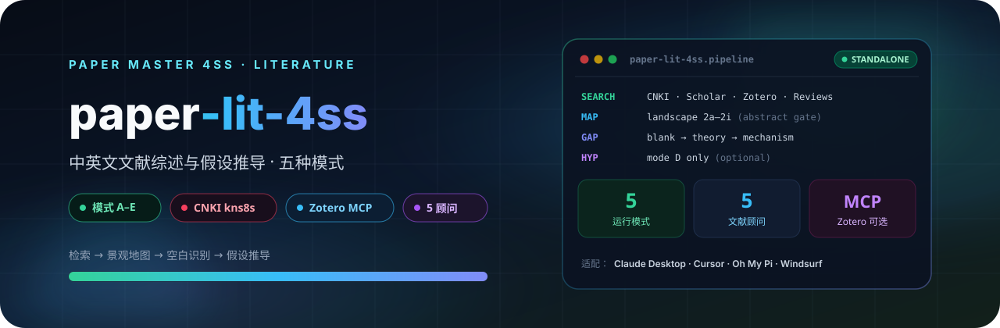

<p align="center">
  
</p>

# Paper 文献综述 4SS

中英文双语文献综述与假设推导一体化技能。支持五种模式：完整文献地图（A）、定向综述（B）、快速概览（C）、文献综述+假设推导（D）、知网专项搜索（E）。自动搜索本地文献库、CNKI 中文文献（浏览器控制 kns8s 专业检索，后端为 ZCode 内置 browser-use 或 OMP pi-chrome）、Google Scholar、WebSearch、Annual Reviews，生成结构化文献景观地图；收到理论、规范或阐释设计报告时在既有流程中组织支持立场、竞争立场和反例材料，不强制假设推导。当用户需要写文献综述、做系统回顾、找研究空白、提出研究假设、搜索中英文文献时使用。

## 4SS 家族

| 包 | 职责 |
|---|---|
| [paper-master-4ss](https://github.com/JingYangYuan/paper-master-4ss) | 总控：登记输入、选择模块、维护工作区 |
| [paper-design-4ss](https://github.com/JingYangYuan/paper-design-4ss) | 选题、框架路由、研究设计蓝图 |
| **[paper-lit-4ss](https://github.com/JingYangYuan/paper-lit-4ss)**（本仓库） | 中英文检索、文献地图、空白与假设 |
| [paper-outline-4ss](https://github.com/JingYangYuan/paper-outline-4ss) | 素材转大纲、证据映射、缺口报告 |
| [paper-analysis-4ss](https://github.com/JingYangYuan/paper-analysis-4ss) | 定量 / 质性 / 混合，Stata · R · Python |
| [paper-write-4ss](https://github.com/JingYangYuan/paper-write-4ss) | 章节写作、润色、语言扫描、正文净稿 |
| [paper-check-4ss](https://github.com/JingYangYuan/paper-check-4ss) | 全文审稿、质量门控与精确回流 |
| [paper-submission-4ss](https://github.com/JingYangYuan/paper-submission-4ss) | Word 导出、体例、投稿清单与信函 |
| [paper-update-4ss](https://github.com/JingYangYuan/paper-update-4ss) | 待审核更新包，不直接改核心文件 |

## 它做什么

按固定检索顺序做中英文文献综述：方向确认 → WebSearch → 本地库 / Zotero MCP（可选）→ Annual Reviews → 引文链 → CNKI / Google Scholar 精准补充 → 文献地图。模式 D 才推导假设。

Zotero 是可选增强。启用后按 `references/zotero-local-mcp.md` 做能力检查、本地库检索、摘要即时入库和全文深读；未启用不得强制安装。

## 五种模式

| 模式 | 用途 |
|---|---|
| A 完整地图 | 6 轮以上检索，40–80 篇 |
| B 定向综述 | 4 轮，15–30 篇 |
| C 快速概览 | 2 轮，10–20 篇 |
| D 综述+假设 | 5 轮以上，含假设推导 |
| E 知网专项 | CNKI kns8s 闭环为主 |

CNKI 依赖可见浏览器控制，后端二选一：ZCode 内置 browser-use（无需安装），或 OMP pi-chrome（一次性加载伴生 Chrome 扩展，见 `references/pi-chrome-browser.md`）。Google Scholar 用 WebFetch/WebSearch。

OMP 后端的插件本体与适配文档在同一发行仓：<https://github.com/JingYangYuan/pi-chrome-mirror>（由本包 `scripts/export_pi_chrome_repo.py` 同步导出，含完整插件与伴生扩展）。

## 安装

将本目录放到宿主的 skill 目录。入口见 `SKILL.md`。

```bash
git clone https://github.com/JingYangYuan/paper-lit-4ss.git
```

与 [`paper-master-4ss`](https://github.com/JingYangYuan/paper-master-4ss) 同级安装时，跨模块路径才能解析。只做本模块任务也可以单独使用。

## 与总控的关系

本包由总控 [`paper-master-4ss`](https://github.com/JingYangYuan/paper-master-4ss) 导出；对应源目录是总控包内的 `modules/lit/`：

- 包内相对路径相对本包根目录解析
- `master/` 与部分 `references/` 是导出时的协议快照
- 更新方式：修改总控任一模块、家族表、路由或协议后，必须无参数重新导出**全部**独立包并 push 全部 GitHub 仓；不要只改本仓库，也不要只导出改过的那一个。

## License

[MIT](LICENSE)
