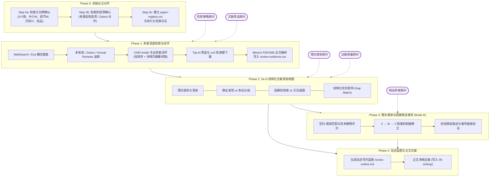

# Paper-Lit-4SS: 中英文社科文献综述与假设推导一体化智能体系统

<div align="center">

[](LICENSE)
[](https://www.python.org/)
[](agents/)
[](references/cnki-kns8s-closed-loop.md)
[](scripts/mineru/)

**专为社会科学（社会学、政治学、经济学、公共管理、传播学等）打造的高阶文献综述、全证据溯源与因果假设推导智能体系统**

[功能特性](#-核心特性) • [运行模式](#-五大运行模式) • [多智能体协同](#-多智能体协同机制) • [流程架构](#-流程架构) • [快速上手](#-快速上手) • [输出产物](#-输出产物规范)

</div>

---

## 📖 项目简介

在传统学术研究与论文写作中，文献综述往往面临**检索碎片化、中英文献割裂、文献引用幻觉、文献堆砌缺乏对话、空白到假设断层**等核心痛点。

`paper-lit-4ss` 是一套深度面向社会科学实证与理论研究的专业文献综述与假设推导一体化 Agent 技能包。本系统集成**多源学术检索网络（CNKI 专业检索闭环、Google Scholar、Exa 语义检索、Annual Reviews 经典溯源、Zotero 本地库联动）**，通过 **5 大学术顾问智能体协同分工**，构建起从**检索方向对齐 → 结构化文献景观地图 → 理论框架裁决 → 因果机制与假设链条推导 → 原文精准定位全文化**的工业级学术研究流水线。

---

## ⚡ 核心特性

### 1. 🔍 中英文立体化多源检索与 CNKI 闭环
- **CNKI kns8s 浏览器操纵闭环**：基于浏览器控制实现知网专业检索（`SU=(...)`）、CSSCI / 北大核心 / AMI 权威来源精确收窄、相关度与被引双排序、详情页摘要穿透抓取。
- **免弹窗批量下载**：内置 `scripts/cnki/kns8s-download.sh`，基于 Cookie + curl 稳健捕获全文 PDF，彻底规避浏览器弹窗干扰。
- **全球前沿文献覆盖**：首选 Exa 语义检索批量捕获英文前沿，配合 Google Scholar、Annual Reviews 顶级综述脉络及引文网络向前/向后滚雪球扩展。
- **Zotero 无缝联动**：支持通过 Zotero Connector / MCP 自动录入结构化题录与 `abstractNote`，支持本地已有文献知识库复用。

### 2. 🤖 5 大专属社科顾问智能体并行分工
内置按顶级社科同行评审标准设计的 5 位专家顾问角色（详见 `agents/`）：
- **检索策略顾问 (`search-strategy-consultant`)**：负责概念族解构、布尔式与专业检索式设计、来源配比与盲区补洞；
- **文献筛选顾问 (`screening-consultant`)**：执行严格的纳入/排除标准，识别文献方法学噪音；
- **理论谱系顾问 (`theory-map-consultant`)**：梳理流派渊源、概念争鸣与知识空白；
- **证据质量顾问 (`evidence-quality-consultant`)**：评定实证证据等级、因果识别有效性与适用边界；
- **假设桥接顾问 (`hypothesis-bridge-consultant`)**：衔接研究空白与理论解释力，闭环构建因果假说。

### 3. 🗺️ 2a–2i 维度结构化文献景观地图
拒绝无意义的文献线性罗列，系统化输出 9 大社科分析维度：
- **2a 领域演进**：时代划分、范式转移与关键转折点
- **2b 理论版图**：主流框架 × 核心命题 × 理论预期 × 经验地位
- **2c 确证事实**：当前证据足以支撑的稳健发现与适用边界
- **2d 争议前沿**：经验证据分歧 × 异质性来源 × 测量口径差异
- **2e 零解与空缺**：区分非显著效应、零效应与文献尚未探索的真正盲区
- **2f 机制清单**：所有提出机制 × 中介/调节类型 × 实证检验就绪度
- **2g 方法版图**：主导实证设计、核心数据集（CFPS/CGSS/CHARLS/CHIPS 等）、识别策略与局限
- **2h 空白排序**：发表潜力 × 可行性综合象限评估
- **2i 理论交接**：空白与核心理论框架对接，输出机制推导就绪评估

### 4. 🔗 四步闭环因果假设推导链（模式 D 专享）
彻底告别“拍脑袋”假设，每条研究假设严格满足**推导链表验证**：
$$\text{研究空白 (Gap)} \longrightarrow \text{理论框架预测 (Theory)} \longrightarrow \text{传导机制链 (Mechanism)} \longrightarrow \text{经验可测假设 (Hypothesis)}$$
配套 Mermaid 因果机制图（$X \to M \to Y$ 及调节条件 $W$），详述替代解释与竞争假设排除方案。

### 5. 📑 唯一注册表与 MinerU PDF 全文精准定位
- **结构化溯源注册表 (`paper-registry.csv`)**：统一记录文献哈希、元数据、下载状态与全文解析状态；
- **MinerU PDF2MD 原文深度解析**：内置自包含解析器 `scripts/mineru/pdf2md.py`，将文献精准转换为结构化 Markdown；
- **证据矩阵精准锚定 (`review-evidence.csv`)**：正文中的每一条关键核心主张必须定位到原文段落或页码，严禁无来源引证。

### 6. 🏛️ 内置 14 大社科主流学科理论框架库
在 `design/frame/` 中提供深度的社科主流学科理论框架库，按需路由：
> 社会学、政治学、经济学、公共管理学、传播学、法学、马克思主义理论、心理学、国际政治、中共党史、当代中国研究、哲学、社科方法论、新思想专题。

---

## 🚀 五大运行模式

系统支持通过模式参数自动路由至适配的工作流规格：

| 模式标识 | 模式名称 | 检索轮次 | 纳选文献数 | 产出规模 | 适用场景 | 假设推导 |
|:---:|:---|:---:|:---:|:---:|:---|:---:|
| **A** | **完整文献地图 (Landscape)** | 6 轮+ | 40–80 篇 | 3,000–10,000 字 | 毕业论文综述章、独立综述发表、大课题开题 | 否 |
| **B** | **定向聚焦综述 (Targeted)** | 4 轮 | 15–30 篇 | 1,000–3,000 字 | 期刊前言文献回顾、特定机理或子问题聚焦 | 否 |
| **C** | **快速学术概览 (Rapid)** | 2 轮 | 10–20 篇 | 500–1,500 字 | 前期预研、快速摸底新领域可行性 | 否 |
| **D** | **文献综述+假设推导 (Hypothesis)** | 5 轮+ | 30–60 篇 | 2,000–5,000 字 | 定量实证论文前两章一体化构建 | **是** |
| **E** | **知网专项闭环 (CNKI)** | 专项闭环 | 10–30 篇 | 结构化档案 | 国内中文期刊文献深度扫描、精准批量取盘 | 否 |

---

## 🔄 流程架构



---

## 📁 目录结构

```text
paper-lit-4ss/
├── SKILL.md                 # 核心技能调度定义（Prompt、路由矩阵、协议铁律）
├── README.md                # 项目全景说明
├── agents/                  # 5 大社科专家顾问定义
│   ├── search-strategy-consultant.md
│   ├── screening-consultant.md
│   ├── theory-map-consultant.md
│   ├── evidence-quality-consultant.md
│   └── hypothesis-bridge-consultant.md
├── phases/                  # 5 大执行子阶段细则
│   ├── phase-0-init.md      # 初始化与对齐
│   ├── phase-1-search.md    # 检索与实操（含 Step 8-10 强制闭环）
│   ├── phase-2-landscape.md # 2a-2i 景观地图
│   ├── phase-3-hypothesis.md# 理论假设推导
│   └── phase-4-write.md     # 蓝图与交接
├── design/frame/            # 14 大社科主流学科理论框架库
│   ├── theory-frameworks-sociological.md
│   ├── theory-frameworks-economics.md
│   ├── theory-frameworks-political-science.md
│   ├── theory-frameworks-public-admin.md
│   └── ... (共 14 个学科库文件)
├── references/              # 协议参考与规范手册
│   ├── cnki-kns8s-closed-loop.md # 知网 kns8s 自动化操作协议
│   ├── gap-to-hypothesis.md      # 空白到假设推导指南
│   ├── search-strategies.md      # 中英文搜索策略与布尔式构建
│   ├── synthesis-guide.md        # 综述段落叙事与过渡模板
│   └── install-dependencies.md   # 环境验收与依赖指南
├── master/                  # 总控交互契约与输出规范
│   ├── literature-review-protocol.md
│   ├── workspace-contract.md
│   └── output-protocol.md
└── scripts/                 # 执行辅助脚本
    ├── cnki/
    │   └── kns8s-download.sh     # CNKI 免弹窗 Cookie+curl 批量下载器
    ├── mineru/
    │   └── pdf2md.py             # MinerU PDF 全文结构化解析脚本
    └── literature_registry.py   # 题录与证据注册表工具
```

---

## 🛠️ 快速上手

### 1. 作为 Agent Skill 安装与调用

将本仓库克隆至你的 Agent Skills 目录（例如 `~/.skills-manager/skills/` 或各 Agent 环境的 skills 目录）：

```bash
git clone https://github.com/JingYangYuan/paper-lit-4ss.git paper-lit-4ss
```

#### 指令调用范式

```text
/paper-lit-4ss [研究主题] [模式: 完整|定向|快速|假设|知网] [可选: 目标期刊]
```

#### 典型使用示例

- **完整综述地图（模式 A）**：
  ```text
  /paper-lit-4ss 数字经济对共同富裕的影响 完整 经济研究
  ```
- **文献综述与假设推导一体化（模式 D）**：
  ```text
  /paper-lit-4ss 平台算法对零工劳动者工作倦怠的影响机制 假设 社会学研究
  ```
- **知网国内核心文献定向捕获（模式 E）**：
  ```text
  /paper-lit-4ss 新质生产力与产业转型升级 知网 管理世界
  ```

---

## 📊 输出产物规范

所有过程与交付产物严格遵循工作区统一规范，写入 `paper-workspace/02-literature/` 对应路径：

| 产物文件 | 产物类型 | 核心内容 |
|---|---|---|
| `paper-registry.csv` | 唯一文献题录注册表 | 记录所有检索到文献的 ID、标题、作者、年份、来源、相关度、PDF/MD 路径与状态 |
| `review-evidence.csv` | 实证证据矩阵 | 记录核心论断与发现，附严格的**原文位置锚定**（章节/页码/段落） |
| `literature-map.md` | 2a–2i 综合文献地图 | 领域演进、理论版图、争议发现、机制清单、方法评析与空白表 |
| `gap-map.md` | 结构化研究空白图谱 | 现有研究与本研究立论空间的边界划分 |
| `hypothesis-derivation.md` | 因果机制与假设推导链 | 理论机制推导表、Mermaid 因果因径图、实证检验假设陈述 |
| `review-outline.md` | 综述写作大纲与段落蓝图 | 将证据矩阵映射至正文写作段落各级标题与核心任务 |
| `papers/` | 原始文献库 | 规范命名的文献 PDF 全文归档 |
| `fulltext/` | 结构化全文库 | 由 MinerU 解析生成的 Markdown 文档（含提取图表与目录） |

> **⚠️ 过程与正文解耦铁律**：  
> `02-literature/` 负责完整留存全流程过程证据；可直接用于论文正文发表的成稿净稿交由下游 `paper-write-4ss` 统一渲染至 `paper-workspace/05-writing/literature-review.md`，杜绝过程碎片材料混入论文正文。

---

## ⚖️ 严密学术铁律 (Guardrails)

1. **摘要铁律 (Abstract Requirement)**：所有被纳入文献地图与证据矩阵的论文，必须具备经过核验的摘要或正文信息；严禁仅凭“标题+作者”脑补推断内容。
2. **拒绝幻觉 (Zero Hallucination)**：关键主张必须逐条在 `review-evidence.csv` 中回溯至原文，杜绝编造引证。
3. **真实人工闸门**：涉及 CNKI 登录、图形验证码时，系统在可见浏览器面板挂起并等待人工安全操作，不作不可靠的后台暴力绕过。
4. **非显著与零结果严格区分**：严格区分统计上的“非显著/零效应”与“文献暂未研究”，维护社科严谨性。

---

## 📄 开源许可

本项目遵循 [MIT License](LICENSE) 开源协议。欢迎提出 Issue 与 Pull Request 共同完善社科研究的自动化生产力体系！
